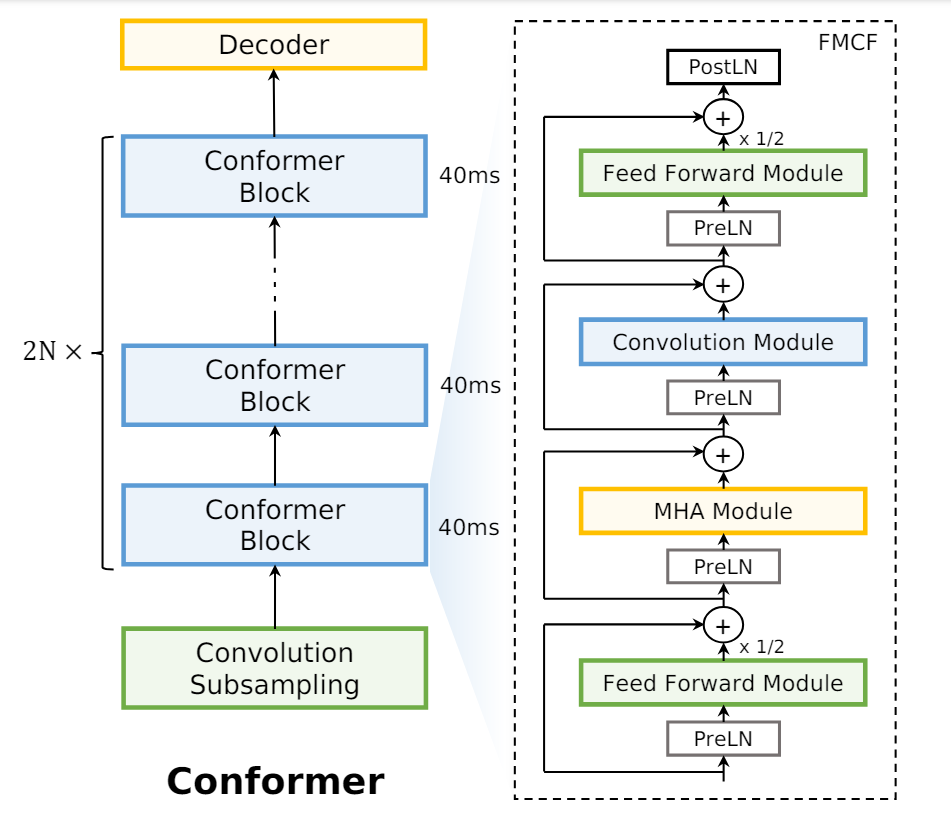

# Automatic Speech Recognition

## Inputs/Features

### Audio

### Waveform

### Spectogram

[source](https://medium.com/analytics-vidhya/understanding-the-mel-spectrogram-fca2afa2ce53)

[source](https://medium.com/analytics-vidhya/understanding-the-mel-spectrogram-fca2afa2ce53)

### Mel-Spectogram

### Masking

[source](https://spectra.mathpix.com/article/2021.09.00002/asr-data-augmentation)

## Model 

### Conformer

[source](https://arxiv.org/pdf/2206.00888)

### Squeezeformer 

[source](https://arxiv.org/pdf/2206.00888)

### Autoregressive Decoder

[source](https://medium.com/@savanmorya/auto-regressive-decoding-vs-non-autoregressive-decoding-14a5fca44d97)

### Non-Autoregressive Decoder

[source](https://leimao.github.io/blog/CTC-Alignment-Combinations/)

[source](https://voidful.medium.com/understanding-ctc-loss-for-speech-recognition-a16a3ef4da92)

# Federated Learning

[source](https://medium.com/nerd-for-tech/build-your-own-federated-learning-model-2c882ea8cfde)

